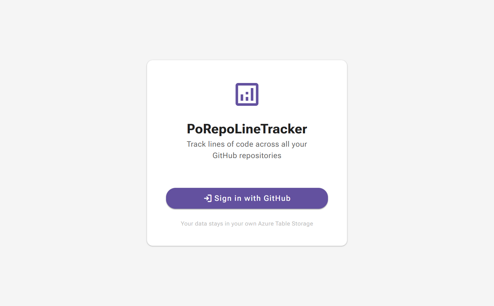

# PoRepoLineTracker

[](https://github.com/YOUR-USERNAME/PoRepoLineTracker/actions/workflows/azure-dev.yml)

Track lines of code across all your GitHub repositories — commit by commit, extension by extension. Self-hosted on Azure, data stays in your own Azure Table Storage.



---

## What it does

- **GitHub OAuth login** — sign in in 2 clicks, no username/password stored.
- **Add repositories** — select from your GitHub repo list, bulk or single.
- **Commit analysis pipeline** — clones via LibGit2Sharp, counts added/removed/total lines per commit, filtered by configurable file extensions.
- **LOC trend charts** — Radzen line chart showing historic total lines over up to 365 days.
- **File extension breakdown** — % share per extension (`.cs`, `.ts`, `.razor`, …).
- **Failed operations view** — every analysis failure is recorded with full stack trace and retry count.
- **User preferences** — configure which file extensions to count.

---

## Quick start (local dev)

### Prerequisites
- [.NET 10 SDK](https://dotnet.microsoft.com/download/dotnet/10.0)
- [Docker Desktop](https://www.docker.com/products/docker-desktop/) (for Azurite — local Table Storage)

### 1. Start Azurite
```powershell
docker compose up -d
```

### 2. Run the app
```powershell
dotnet run --project src/PoRepoLineTracker.Api
# http://localhost:5000
# http://localhost:5000/health  → 200 OK when ready
```

### 3. Dev login bypass
```
GET http://localhost:5000/test-login-redirect?email=you@example.com
```
Sets an auth cookie without a real GitHub OAuth round-trip.
> Requires Azurite running (user record is written to Table Storage).

For real GitHub OAuth in dev, register a GitHub OAuth App with callback URL `http://localhost:5000/signin-github` and set secrets via `dotnet user-secrets`.

---

## Deploy to Azure

```powershell
# First time only
azd env new prod
azd env set AZURE_LOCATION eastus

# Provision + deploy (idempotent)
azd up
```

After provisioning, add the three required Key Vault secrets:
```powershell
az keyvault secret set --vault-name <kv-name> --name "GitHub--ClientId"     --value "<value>"
az keyvault secret set --vault-name <kv-name> --name "GitHub--ClientSecret" --value "<value>"
az keyvault secret set --vault-name <kv-name> --name "GitHub--PAT"          --value "<value>"
```

See [docs/DevOps.md](docs/DevOps.md) for the full CI/CD setup (OIDC, GitHub Actions, shared Azure resources).

---

## Documentation

| Document | Description |
|----------|-------------|
| [docs/ProductSpec.md](docs/ProductSpec.md) | Goals, features, personas, NFRs |
| [docs/DevOps.md](docs/DevOps.md) | CI/CD, Azure infra, local dev, secrets setup |
| [docs/Architecture.mmd](docs/Architecture.mmd) | C4 Context diagram (Mermaid) |
| [docs/Architecture_SIMPLE.mmd](docs/Architecture_SIMPLE.mmd) | Simplified 4-node context (Mermaid) |
| [docs/SystemFlow.mmd](docs/SystemFlow.mmd) | Auth + pipeline + CRUD sequence (Mermaid) |
| [docs/SystemFlow_SIMPLE.mmd](docs/SystemFlow_SIMPLE.mmd) | Happy-path 6-node flowchart (Mermaid) |
| [docs/DataModel.mmd](docs/DataModel.mmd) | Full ER diagram with all fields (Mermaid) |
| [docs/DataModel_SIMPLE.mmd](docs/DataModel_SIMPLE.mmd) | 4-entity ER overview (Mermaid) |

---

## Architecture overview

```
┌─────────────────────────────────────────────────────┐
│                  Azure App Service                  │
│  ┌──────────────────┐   ┌────────────────────────┐  │
│  │  Blazor WASM     │   │  ASP.NET Core API       │  │
│  │  (static files)  │◄──│  .NET 10 / MediatR      │  │
│  └──────────────────┘   └────────────┬───────────┘  │
└───────────────────────────────────────┼─────────────┘
                                        │
          ┌─────────────────────────────┼────────────────────┐
          ▼                             ▼                     ▼
  GitHub OAuth              Azure Table Storage         Key Vault
  (login + repos)           (4 tables, user-owned)      (secrets via MI)
```

See [docs/Architecture.mmd](docs/Architecture.mmd) for the full C4 L1 diagram.

---

## Project structure

```
src/
  PoRepoLineTracker.Api/          ASP.NET Core API + Blazor WASM host
  PoRepoLineTracker.Client/       Blazor WASM frontend (Radzen Material3 theme)
  PoRepoLineTracker.Application/  MediatR commands/queries, service interfaces
  PoRepoLineTracker.Domain/       Core entities (User, GitHubRepository, CommitLineCount, …)
  PoRepoLineTracker.Infrastructure/ Azure Table Storage, LibGit2Sharp, GitHub client
tests/
  PoRepoLineTracker.UnitTests/
  PoRepoLineTracker.IntegrationTests/
  PoRepoLineTracker.E2ETests.TS/  Playwright / TypeScript
infra/
  main.bicep                      azd entry point
  resources.bicep                 App Service, Storage, Key Vault, App Insights
docs/
  Architecture.mmd / _SIMPLE.mmd
  SystemFlow.mmd / _SIMPLE.mmd
  DataModel.mmd / _SIMPLE.mmd
  ProductSpec.md
  DevOps.md
  screenshots/
```

---

## Running tests

```powershell
# Unit
dotnet test tests/PoRepoLineTracker.UnitTests

# Integration (requires Azurite)
docker compose up -d
dotnet test tests/PoRepoLineTracker.IntegrationTests

# E2E (Playwright)
cd tests/PoRepoLineTracker.E2ETests.TS
npm install
npx playwright test
```

---

## Security notes

- Auth cookie: HttpOnly, Secure, SameSite=Lax, 7-day sliding expiry.
- Managed Identity (SystemAssigned) used for Key Vault — no credentials in config.
- HTTPS enforced at App Service level + HSTS middleware.
- All secrets in Key Vault — never in source control.
