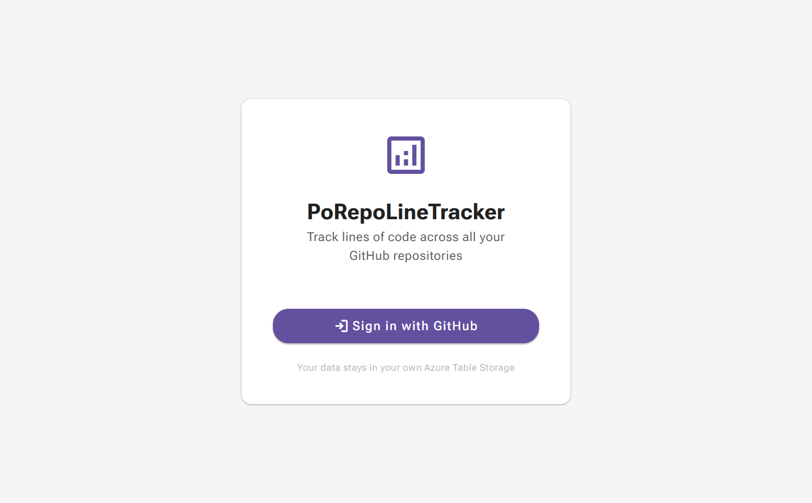

# PoRepoLineTracker

PoRepoLineTracker is a self-hosted GitHub repository analytics app built with Blazor WebAssembly and an ASP.NET Core API. It authenticates with GitHub, tracks user-owned repositories, clones and analyzes commit history, persists derived metrics in Azure Table Storage, and surfaces line-count trends, extension breakdowns, top files, and failure diagnostics.



## Architecture overview

- Edge delivery: a Blazor WebAssembly client is served from the same App Service as the API.
- Compute tier: minimal APIs handle auth, settings, repository CRUD, GitHub lookups, diagnostics, and failure management; MediatR handlers and background tasks coordinate analysis and retries.
- Data tier: Azure Table Storage holds users, repositories, commit aggregates, failed operations, top-file snapshots, and user preferences.
- External dependencies: GitHub provides OAuth identity, repository metadata, and clone/pull access; Azure Key Vault provides secrets; Application Insights and Log Analytics collect telemetry.

## Documentation suite

| Document | Purpose |
| --- | --- |
| [docs/Architecture_MASTER.mmd](docs/Architecture_MASTER.mmd) | Full context/container view across edge, compute, and persistence tiers |
| [docs/Architecture_MASTER_SIMPLE.mmd](docs/Architecture_MASTER_SIMPLE.mmd) | Executive-summary version of the architecture |
| [docs/DataLifecycle_MASTER.mmd](docs/DataLifecycle_MASTER.mmd) | End-to-end ingestion, processing, persistence, and UI refresh flow |
| [docs/DataLifecycle_MASTER_SIMPLE.mmd](docs/DataLifecycle_MASTER_SIMPLE.mmd) | High-level data lifecycle snapshot |
| [docs/DataModel.mmd](docs/DataModel.mmd) | Storage-oriented ERD with derived lifecycle/state fields |
| [docs/DataModel_SIMPLE.mmd](docs/DataModel_SIMPLE.mmd) | Reduced ERD for stakeholder review |
| [docs/SystemFlow_MASTER.mmd](docs/SystemFlow_MASTER.mmd) | Combined user journey, auth path, CRUD path, and analysis pipeline |
| [docs/SystemFlow_MASTER_SIMPLE.mmd](docs/SystemFlow_MASTER_SIMPLE.mmd) | High-level system flow |
| [docs/MultiplayerFlow.mmd](docs/MultiplayerFlow.mmd) | Concurrent-session sequence showing isolation and conflict handling |
| [docs/MultiplayerFlow_SIMPLE.mmd](docs/MultiplayerFlow_SIMPLE.mmd) | Simplified concurrent-session sequence |
| [docs/RefactorBlastRadius.md](docs/RefactorBlastRadius.md) | Impact assessment for the documentation consolidation refactor |
| [tests/README.md](tests/README.md) | Test scopes and local execution commands |

## Runtime summary

- Auth: GitHub OAuth issues an application cookie; user metadata and tokens are upserted to storage on sign-in.
- Repository management: users add repositories individually or in bulk, then queue background analysis or full re-analysis.
- Analysis pipeline: the app clones or pulls repositories locally, filters files by user-selected extensions, computes commit-level totals, and writes derived records back to Azure Table Storage.
- Presentation: the client reads repository history, top files, extension percentages, failed operations, and user preferences from the same API host.
- Operations: Serilog writes console and file logs in development; Application Insights and Log Analytics receive cloud telemetry.

## Local development

### Prerequisites

- .NET 10 SDK
- Docker Desktop for Azurite

### Start dependencies

```powershell
docker compose up -d
```

### Run the app

```powershell
dotnet run --project src/PoRepoLineTracker.Api
```

### Optional dev login shortcut

```text
GET http://localhost:5001/dev-login/00000000-0000-0000-0000-000000000001
```

This bypasses GitHub OAuth in Development and seeds a deterministic test user.
Use any GUID; the one above matches the seeded dev identity.

## Azure deployment

The app is deployed with `azd` using Bicep in [infra/main.bicep](infra/main.bicep) and [infra/resources.bicep](infra/resources.bicep). The deployed topology is a Linux App Service running the combined API + WASM host, backed by Azure Table Storage, Key Vault, Container Registry, and Application Insights.

```powershell
azd env new prod
azd env set AZURE_LOCATION eastus
azd up
```

## Screenshots

Application screenshots are intentionally reserved under [docs/screenshots](docs/screenshots) so product context stays colocated with the documentation suite without mixing runtime assets into source folders.
